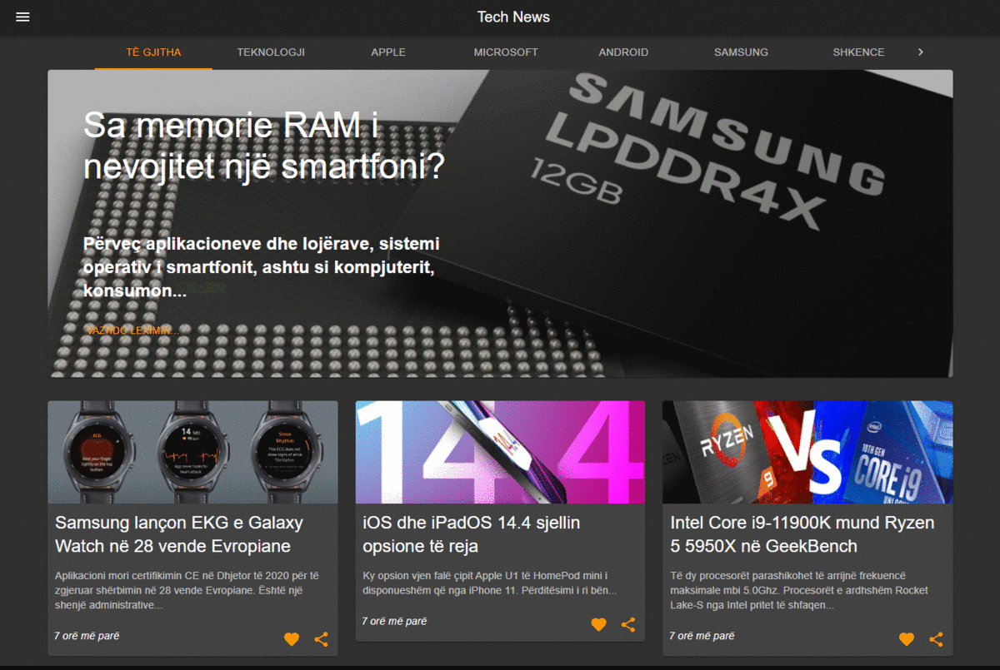
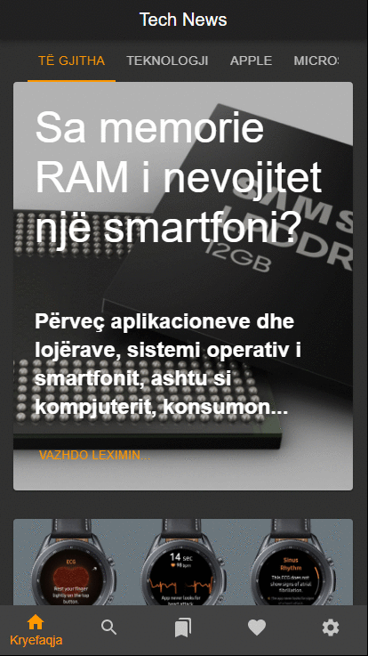

# PWA Blog template using ReactJs and Material UI

This is a template PWA - Progresive Web Application that uses ReactJs and Material UI.  
App works offline by saving responses in localStorage.  
Currently I've done the development in a subfolder ('/pwa/'). To run in the root folder just remove the ("homepage": "/pwa/",) in the package.json file. (Also remove the "set HOST=intranet&& " from scripts->start property in package.json)

<b>Store is now managed by React-Redux.</b>
<del>Store is managed using React's Context API. </del> 
<i>Switch to <b>"react-context"</b> branch to see the React-Contex version</i> 

<i>(Posts are being retrieved from a wordpress site using the WordPress REST API)</i>

Steps to install and start playing with the project:

1. git clone https://github.com/edisonneza/react-blog.git
2. npm i
3. npm run start

To generate build files (by removing the source map files) 

* npm run winBuild
 
or <i>(if LINUX)</i>

* npm run build

See GIFs below on desktop and mobile devices:

